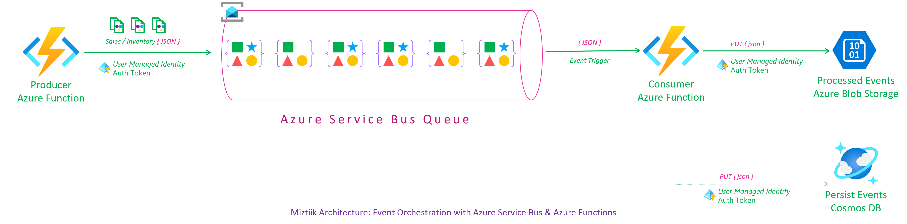
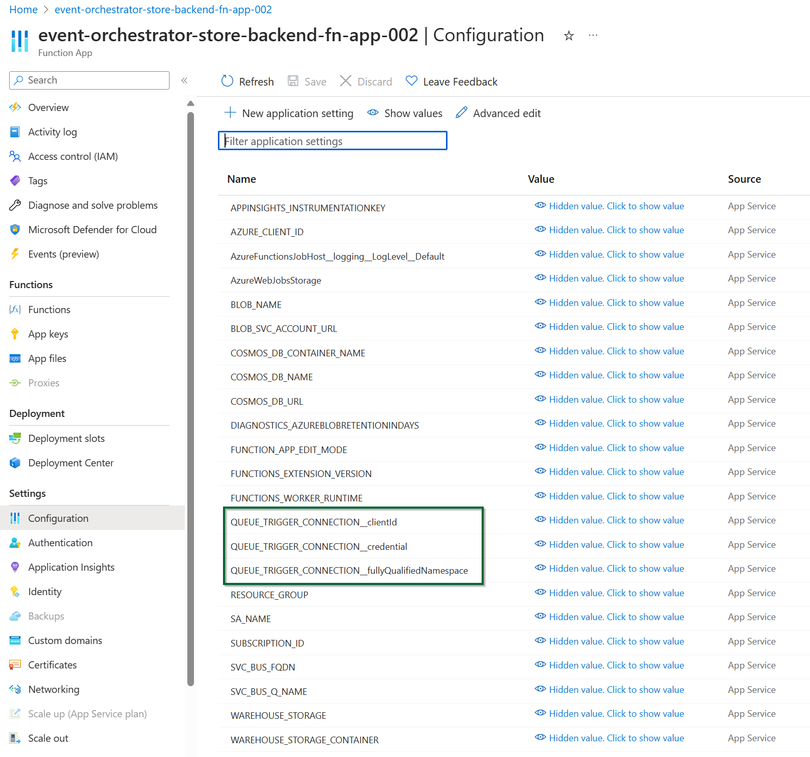
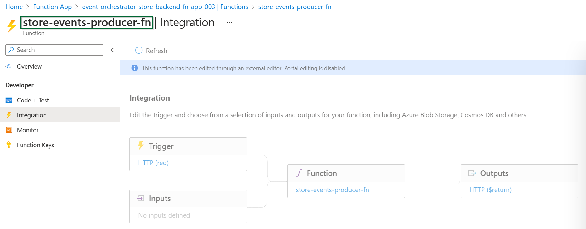
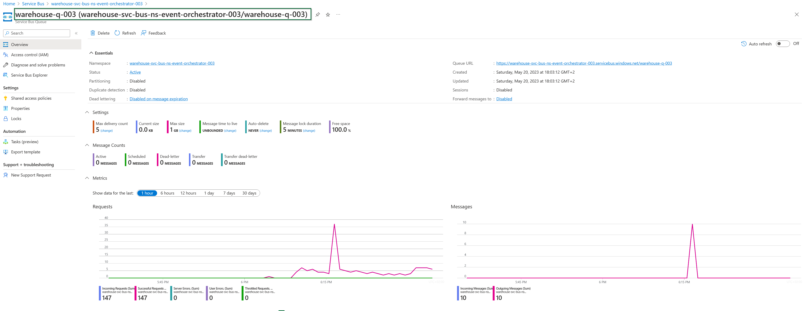
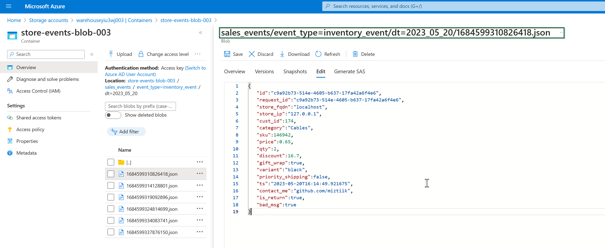
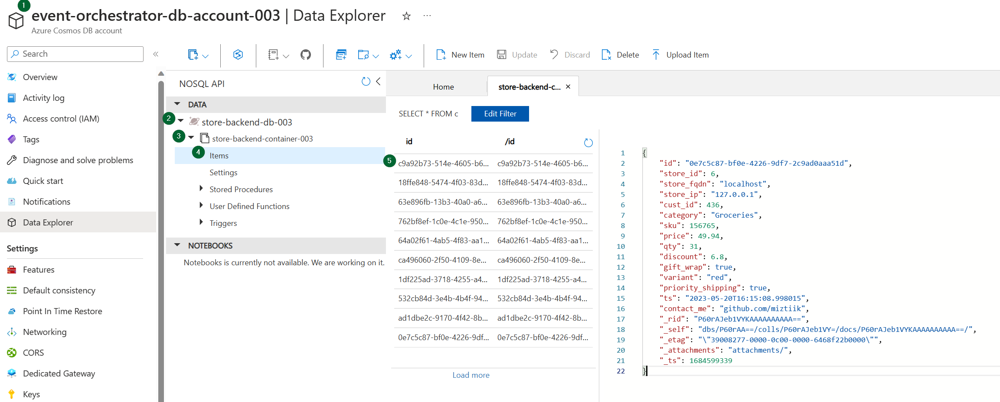

# Orchestrating Events with Azure Service Bus and Azure Functions using Managed Identity

The developers at Mystique Unicorn's developers are looking for a way to orchestrate sales events and inventory events. They want to use Azure Service Bus to orchestrate the events. They also want to use Azure Functions to generate the events. They want to use managed identity to authenticate to the service bus. Can you help them?

## 🎯 Solution

We can utilize Azure Service Bus and the Python SDK to orchestrate events. Azure Service Bus offers a dependable messaging platform for event orchestration. Our demo showcases an Azure Function with a managed identity that produces events, sending them to a designated queue within a specified service bus namespace. The producer adds custom properties and sets the time to live to 1 day. An example event is provided below.

```json
{
  "id": "743da362-69df-4e63-a95f-a1d93e29825e",
  "request_id": "743da362-69df-4e63-a95f-a1d93e29825e",
  "store_id": 5,
  "store_fqdn": "localhost",
  "store_ip": "127.0.0.1",
  "cust_id": 549,
  "category": "Notebooks",
  "sku": 169008,
  "price": 45.85,
  "qty": 34,
  "discount": 10.3,
  "gift_wrap": true,
  "variant": "red",
  "priority_shipping": false,
  "ts": "2023-05-19T14:36:09.985501",
  "contact_me": "github.com/miztiik",
  "is_return": true
}
```

Message custom properties,

```json
{
   "event_type":"sale_event",
   "priority_shipping":false,
}
```

The consumer function leverages an Azure Service Bus trigger to consume events from the queue. It processes and persists the events to Azure Storage Account and Cosmos DB using a scoped managed identity with RBAC (Role-Based Access Control) permissions, ensuring secure and controlled access to the required resources. By leveraging the power of Bicep, all necessary resources can be easily provisioned and managed with minimal effort.

**Note**:

- Azure functions need this `AZURE_CLIENT_ID` environment variable for getting the auth token from AAD, [Thanks to this github issue][10] and this one [here][11] for the solution.
- Azure Service Bus Trigger with managed identity needs these environment variables _Ref these cocs [1][12], [2][13]_
  - `QUEUE_TRIGGER_CONNECTION__fullyQualifiedNamespace` - Name of your service bus namespace
  - `QUEUE_TRIGGER_CONNECTION__credential: 'managedidentity'` - Fixed value
  - `QUEUE_TRIGGER_CONNECTION__clientId` - Client ID of the user assigned managed identity



1. ## 🧰 Prerequisites

   This demo, instructions, scripts and bicep template is designed to be run in `westeurope`. With few or no modifications you can try it out in other regions as well(_Not covered here_).

   - 🛠 Azure CLI Installed & Configured - [Get help here](https://learn.microsoft.com/en-us/cli/azure/install-azure-cli)
   - 🛠 Bicep Installed & Configured - [Get help here](https://learn.microsoft.com/en-us/azure/azure-resource-manager/bicep/install)
   - 🛠 VS Code & Bicep Extenstions - [Get help here](https://learn.microsoft.com/en-us/azure/azure-resource-manager/bicep/install#vs-code-and-bicep-extension)

1. ## ⚙️ Setting up the environment

   - Get the application code

     ```bash
     https://github.com/miztiik/azure-service-bus-event-orchestrator
     cd azure-service-bus-event-orchestrator
     ```

1. ## 🚀 Prepare the environment

   Ensure you have Azure Cli and bicep working

    ```bash
   # You should have azure cli preinstalled
   bicep --version
   az account show
    ```

1. ## 🚀 Deploying the application

   - **Stack: Main Bicep**
     We will create the following resoureces
     - **Storage Accounts** for storing the events
       - General purpose Storage Account - Used by Azure functions to store the function code
       - `warehouse**` -  Azure Function will store the events here
     - **Servie Bus Namespace**
       - Service Bus Queue
     - **Managed Identity**
        - This will be used by the Azure Function to interact with the service bus
     - **Python Azure Function**
        - **Producer**: `HTTP` Trigger. Customized to send `count` number of events to the service bus, using parameters passed in the query string.
        - **Consumer**: `Service Bus` Trigger. The trigger uses managed identity to authenticate to the service bus
     - **Cosmos DB**
        - This will be used by the Azure Function to store the events

      ```bash
      # make deploy
      sh deployment_scripts/deploy.sh
      ```

      After successfully deploying the stack, Check the `Resource Groups/Deployments` section for the resources.

      

      

      

1. ## 🔬 Testing the solution

   - **Trigger the function**

      Post deployment, you should be able to see the function urls in the output section of the deployment. You can also get the function url from the portal.

      ```bash
      FUNC_URL="https://event-orchestrator-store-backend-fn-app-003.azurewebsites.net/api/store-events-producer-fn"
      curl ${FUNC_URL}?count=5
      ```

      You should see an output like this,

      ```json
      {
         "miztiik_event_processed": true,
         "msg": "Generated 8 messages",
         "resp": {
            "status": true,
            "tot_msgs": 8,
            "bad_msgs": 2,
            "sale_evnts": 6,
            "inventory_evnts": 2,
            "tot_sales": 357.96000000000004
         },
         "count": 8,
         "last_processed_on": "2023-05-20T18:36:32.492189"
      }
      ```

      If you navigate to storage account, you should be able to see the events stored in the `warehouse` container. Using the custom properties, the events are stored in different folders with the prefix `sale_event` or `inventory_event`.

      

      

      

1. ## 📒 Conclusion

   In this demonstration, we showcase the utilization of Azure Functions to efficiently produce and consume events to and from Azure Service Bus.
  
1. ## 🧹 CleanUp

   If you want to destroy all the resources created by the stack, Execute the below command to delete the stack, or _you can delete the stack from console as well_

   - Resources created during [Deploying The Application](#-deploying-the-application)
   - _Any other custom resources, you have created for this demo_

   ```bash
   # Delete from resource group
   az group delete --name Miztiik_Enterprises_xxx --yes
   # Follow any on-screen prompt
   ```

   This is not an exhaustive list, please carry out other necessary steps as maybe applicable to your needs.

## 📌 Who is using this

This repository aims to show how to Bicep to new developers, Solution Architects & Ops Engineers in Azure.

### 💡 Help/Suggestions or 🐛 Bugs

Thank you for your interest in contributing to our project. Whether it is a bug report, new feature, correction, or additional documentation or solutions, we greatly value feedback and contributions from our community. [Start here](/issues)

### 👋 Buy me a coffee

[](https://ko-fi.com/Q5Q41QDGK) Buy me a [coffee ☕][900].

### 📚 References

1. [Azure Docs - Managed Identity][8]
1. [Azure Docs - Managed Identity Caching][9]
1. [Gitub Issue - Default Credential Troubleshooting][10]
1. [Gitub Issue - Default Credential Troubleshooting][11]
1. [Azure Service Bus Bindings - Identity-based connections][12]
1. [Azure Functions - Common properties for identity-based connections][13]

[8]: https://learn.microsoft.com/en-us/azure/active-directory/managed-identities-azure-resources/overview
[9]: https://learn.microsoft.com/en-us/azure/app-service/overview-managed-identity?tabs=portal%2Chttp#configure-target-resource
[10]: https://github.com/microsoft/azure-container-apps/issues/442
[11]: https://github.com/microsoft/azure-container-apps/issues/325#issuecomment-1265380377
[12]: https://learn.microsoft.com/en-us/azure/azure-functions/functions-bindings-service-bus-output?tabs=python-v2%2Cin-process%2Cextensionv5&pivots=programming-language-python#identity-based-connections
[13]: https://learn.microsoft.com/en-us/azure/azure-functions/functions-reference?tabs=blob#common-properties-for-identity-based-connections

### 🏷️ Metadata


**Level**: 300

[100]: https://www.udemy.com/course/aws-cloud-security/?referralCode=B7F1B6C78B45ADAF77A9
[101]: https://www.udemy.com/course/aws-cloud-security-proactive-way/?referralCode=71DC542AD4481309A441
[102]: https://www.udemy.com/course/aws-cloud-development-kit-from-beginner-to-professional/?referralCode=E15D7FB64E417C547579
[103]: https://www.udemy.com/course/aws-cloudformation-basics?referralCode=93AD3B1530BC871093D6
[899]: https://www.udemy.com/user/n-kumar/
[900]: https://ko-fi.com/miztiik
[901]: https://ko-fi.com/Q5Q41QDGK